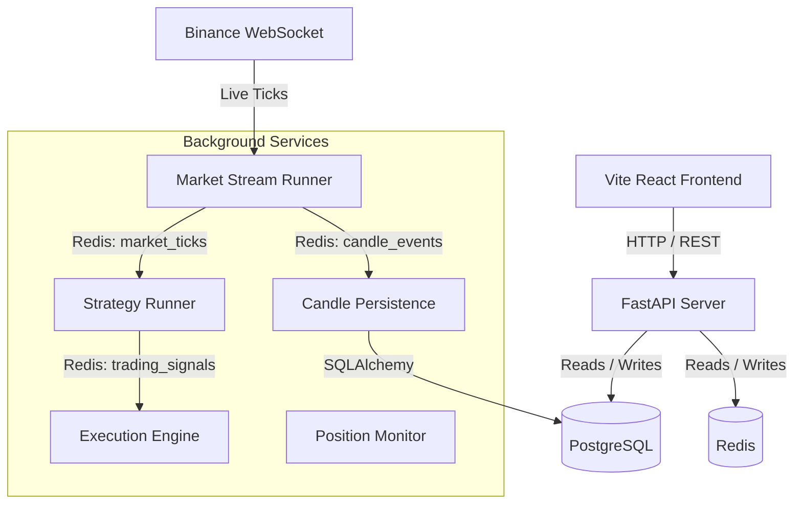

# Getting Started Guide

This guide provides end-to-end setup instructions to get the **Trading Bot** project up and running on a new system. It covers both **macOS** and **Windows** environments.

---

## Architecture Overview

The Trading Bot application consists of two main parts:
1. **Backend**: Python FastAPI application utilizing a Redis event pipeline for real-time market streams, candle persistence, strategy execution, and a PostgreSQL database.
2. **Frontend**: React application built with TypeScript, Vite, and Material-UI (MUI), displaying live charts, portfolio statistics, and active strategies.



---

## 1. Prerequisites

Before starting, ensure the following software is installed on your machine:

### For macOS
- **Homebrew**: Package manager for macOS (run `/bin/bash -c "$(curl -fsSL https://raw.githubusercontent.com/Homebrew/install/HEAD/install.sh)"`).
- **Python 3.9+**: Install via Homebrew: `brew install python@3.9`.
- **Node.js (LTS)**: Install via Homebrew: `brew install node`.
- **Docker Desktop**: Download and install from [Docker for Mac](https://www.docker.com/products/docker-desktop/).
- **Git**: Installed by default or via `brew install git`.

### For Windows
- **Python 3.9+**: Download the installer from the [Official Python Website](https://www.python.org/downloads/). Ensure you check **"Add Python to PATH"** during installation.
- **Node.js (LTS)**: Download and run the installer from the [Official Node.js Website](https://nodejs.org/).
- **Docker Desktop**: Download and install from [Docker for Windows](https://www.docker.com/products/docker-desktop/). (Ensure WSL2 backend is enabled).
- **Git**: Download and install [Git for Windows](https://gitforwindows.org/). This also provides **Git Bash**, which is highly recommended.

---

## 2. Initial Setup

### Step A: Clone the Repository
Open your terminal (Terminal on macOS, or Git Bash / PowerShell on Windows) and clone the repository:
```bash
git clone <your-repository-url>
cd trading-bot
```

### Step B: Configure Environment Variables
Copy the template configuration file to create your local `.env` file:

**On macOS / Git Bash:**
```bash
cp .env.example .env
```

**On Windows PowerShell:**
```powershell
Copy-Item .env.example .env
```

The default values in `.env` are configured to connect to PostgreSQL and Redis running inside local Docker containers.

---

## 3. Backend Setup

### Step A: Initialize Python Virtual Environment

Create and activate a virtual environment to isolate the project dependencies.

#### On macOS
```bash
# Create virtual environment
python3 -m venv venv

# Activate virtual environment
source venv/bin/activate
```

#### On Windows (PowerShell)
```powershell
# Create virtual environment
python -m venv venv

# Activate virtual environment
.\venv\Scripts\Activate.ps1
```

#### On Windows (Command Prompt / CMD)
```cmd
# Create virtual environment
python -m venv venv

# Activate virtual environment
call venv\Scripts\activate.bat
```

---

### Step B: Install Python Dependencies

With the virtual environment activated, install all required packages:
```bash
pip install --upgrade pip
pip install -r requirements.txt
```

---

### Step C: Spin Up Database & Cache (Docker)

Start the PostgreSQL and Redis databases using Docker Compose:
```bash
docker-compose up -d
```
Verify that the containers are running successfully:
```bash
docker ps
```
You should see:
* `tradingbot-postgres` listening on port `5432`
* `tradingbot-redis` listening on port `6379`

---

### Step D: Run Database Migrations

Apply the database schema migrations using Alembic:
```bash
alembic upgrade head
```

---

### Step E: Start Backend Services

To run the full backend environment, you need to run the API server and all the background tasks.

#### Option 1: Using the Startup Script (macOS / Git Bash)
A startup script is provided to spin up all backend processes simultaneously in the background:
```bash
chmod +x start_backend.sh
./start_backend.sh
```
Press `Ctrl+C` in this terminal window to stop all processes cleanly.

#### Option 2: Running Services Individually (Windows / Manual)
If you are on Windows or want to monitor logs for individual services, run each command in a separate terminal tab (make sure your `venv` is activated in each tab):

1. **FastAPI API Server**:
   ```bash
   uvicorn app.main:app --reload --port 8000
   ```
2. **Market Stream Runner**:
   ```bash
   python -m app.tasks.stream_runner
   ```
3. **Candle Persistence Runner**:
   ```bash
   python -m app.tasks.candle_persistence_runner
   ```
4. **Strategy Runner**:
   ```bash
   python -m app.tasks.strategy_runner
   ```
5. **Execution Engine**:
   ```bash
   python -m app.tasks.execution_runner
   ```
6. **Position Monitor**:
   ```bash
   python -m app.tasks.position_monitor
   ```

---

## 4. Frontend Setup

### Step A: Install Node Dependencies
Open a new terminal, navigate to the `frontend` folder, and install package dependencies:
```bash
cd frontend
npm install
```

### Step B: Run Frontend Development Server
Start the Vite development server:
```bash
npm run dev
```
The console will print the local URL (usually `http://localhost:5173`). Open this URL in your web browser.

---

## 5. Verification & Testing

Verify that your local setup is fully functional by running the test suites.

### Test Backend
Activate the virtual environment and run the backend tests:

**On macOS / Git Bash / Linux:**
```bash
./venv/bin/pytest
```

**On Windows:**
```powershell
venv\Scripts\pytest
```

All integration and unit tests should pass with green status.

### Test Frontend
Navigate to the `frontend` directory and run the frontend test suite:
```bash
cd frontend
npm run test
```

### Live Endpoint Check
Confirm the backend is running and healthy by requesting the health API endpoint:
* Open `http://localhost:8000/api/v1/health` in your browser.
* You should receive:
  ```json
  {"success":true,"status":"healthy"}
  ```

---

## Troubleshooting

### 1. Database Connection Errors (`asyncpg`)
* Ensure the Docker containers are running: `docker ps`.
* Check if your database port `5432` is already in use by a local PostgreSQL installation outside Docker. If so, stop the local service or change the port mapping in `docker-compose.yml` and `.env`.

### 2. Redis Connection Refused
* Ensure the Redis container is running: `docker ps`.
* Check if port `6379` is already in use by a local Redis service.

### 3. Windows execution policy block on scripts
* If PowerShell blocks the activation script, run:
  ```powershell
  Set-ExecutionPolicy -ExecutionPolicy RemoteSigned -Scope Process
  ```
  Then run `.\venv\Scripts\Activate.ps1` again.
